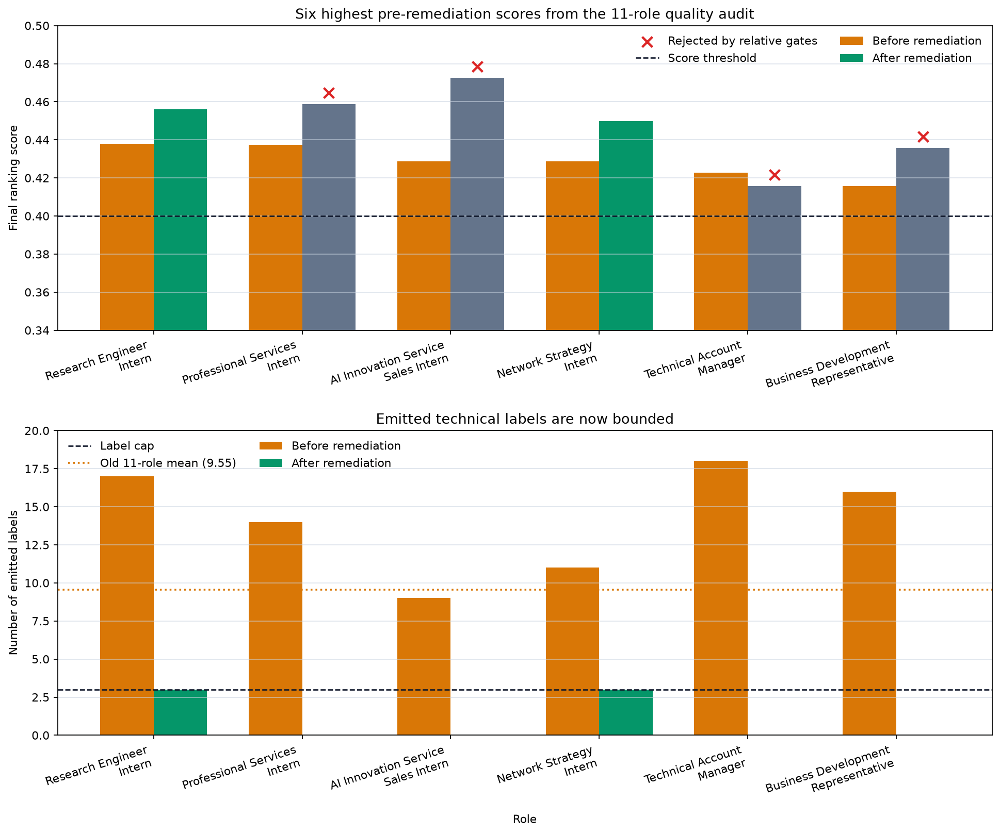
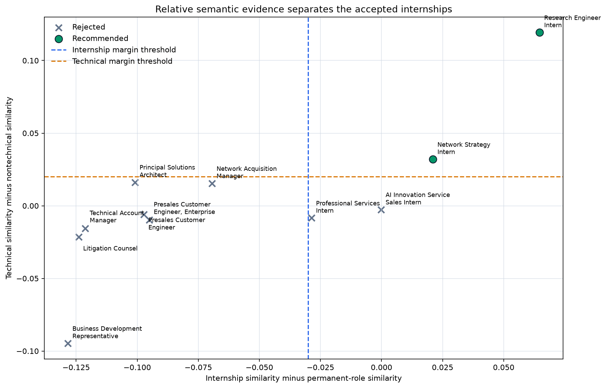
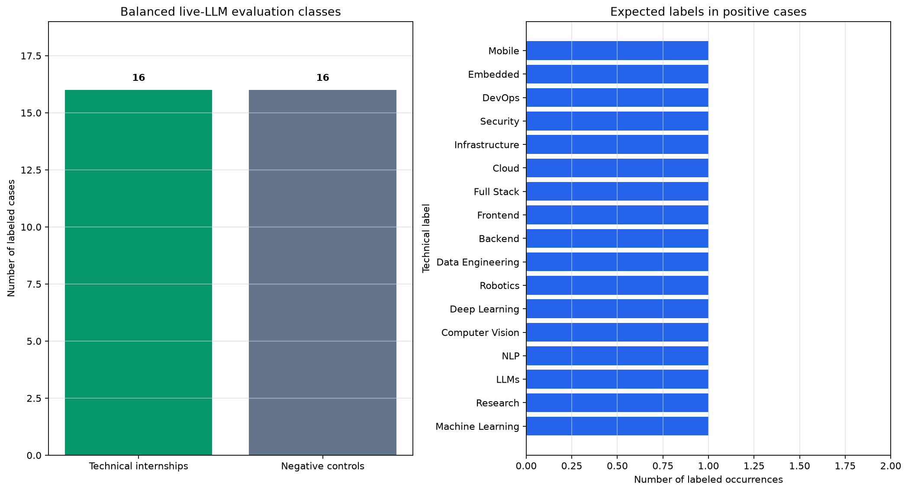
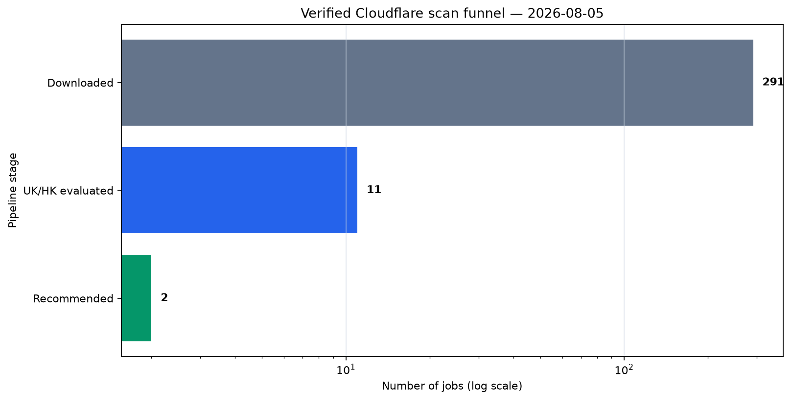
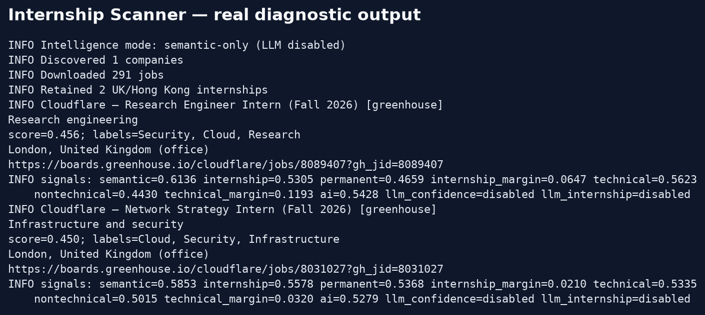

# Internship Scanner

A provider-based internship aggregation and AI recommendation engine. It discovers
configured public ATS boards, normalizes and deduplicates jobs, retrieves likely
internships semantically, optionally performs structured LLM analysis, and ranks
technical roles in the United Kingdom or Hong Kong.

## Supported public providers

- Greenhouse Job Board API
- Lever Postings API
- Ashby Job Postings API
- SmartRecruiters Posting API
- Workable public account endpoint
- Recruitee Careers Site API
- Personio career-site XML feed

See [Provider support](docs/providers.md) for official endpoint references, known
limitations, and the authenticated systems intentionally not fabricated here.

## Setup

Requires Python 3.11 or newer.

```powershell
python -m venv .venv
.venv\Scripts\Activate.ps1
python -m pip install -e .
Copy-Item .env.example .env
```

Configure boards using semicolon-separated entries with the format
`provider|public identifier|display name`:

```dotenv
ATS_COMPANIES=greenhouse|cloudflare|Cloudflare;lever|example|Example Ltd
```

The identifier is the public board token, site name, subdomain, or job-board name
used by that provider. Global company enumeration is not exposed by the supported
ATS APIs, so discovery starts from these identifiers. Providers deduplicate them
and the caching decorator prevents repeated discovery and job requests.

| Variable | Default | Purpose |
| --- | --- | --- |
| `ATS_COMPANIES` | Cloudflare on Greenhouse | Boards to discover |
| `REQUEST_TIMEOUT_SECONDS` | `10` | HTTP request timeout |
| `CACHE_TTL_SECONDS` | `3600` | Discovery/job cache lifetime |
| `CACHE_PATH` | `.cache/internship-scanner.json` | Persistent cache file |
| `LOG_LEVEL` | `INFO` | Python logging level |
| `AI_ENABLED` | `true` | Enable the hybrid AI pipeline |
| `AI_CACHE_PATH` | `.cache/intelligence.sqlite3` | Persistent inference cache |
| `AI_CACHE_VERSION` | `2` | Logical cache invalidation version |
| `EMBEDDING_MODEL` | `BAAI/bge-base-en-v1.5` | Sentence Transformers model |
| `SEMANTIC_THRESHOLD` | `0.45` | Minimum internship similarity |
| `INTERNSHIP_MARGIN_THRESHOLD` | `-0.03` | Internship minus permanent-role score |
| `TECHNICAL_MARGIN_THRESHOLD` | `0.02` | Technical minus nontechnical score |
| `LABEL_THRESHOLD` | `0.45` | Minimum label similarity without an LLM |
| `MAX_LABELS` | `3` | Maximum labels per recommendation |
| `LLM_CONFIDENCE_THRESHOLD` | `0.65` | Minimum structured-analysis confidence |
| `LLM_INTERNSHIP_THRESHOLD` | `0.75` | Minimum LLM internship relevance |
| `RECOMMENDATION_THRESHOLD` | `0.40` | Minimum final ranking score |
| `LLM_PROVIDER` | `none` | Structured-analysis backend |
| `LLM_MODEL` | blank | Provider model identifier |
| `LLM_BASE_URL` | provider default | Optional compatible endpoint override |

See [AI intelligence architecture](docs/intelligence.md) for label and ranking
configuration, provider API-key variables, cache invalidation, failure behavior,
and instructions for switching among OpenAI, Anthropic, Gemini, OpenRouter, and
Ollama. Legacy `BOARD_TOKEN` and `COMPANY_NAME` values remain accepted when
`ATS_COMPANIES` is unset.

## Run

```powershell
internship-scanner
# or
python -m internship_scanner
# compatibility entry point
python main.py

# inspect component scores
python main.py --diagnostics --top-k 5

# show help without loading settings, a model, or job boards
python main.py --help
```

A failure from one company board is logged and isolated so other providers can
complete. The command returns a failure exit status when configuration fails or
every configured board fails.

The default BGE model loads lazily. Its weights are downloaded on the first AI run
and reused by the local model cache afterward. Set `AI_ENABLED=false` to run the
deterministic recovery classifier without loading an embedding model. Remote LLM
analysis is opt-in: `LLM_PROVIDER=none` performs local semantic ranking only.

## Recommendation quality incident and remediation

The first real BGE run exposed a quality failure that the unit suite did not
detect. A Research Engineer internship scored `0.4379`, while a permanent Business
Development Representative scored `0.4157`; the latter received 16 technical
labels. Across the 11 cached roles, an average of 9.55 labels exceeded the old
threshold, illustrating how weakly the original profiles separated job areas.



The investigation confirmed five causes:

1. `LLM_PROVIDER` defaulted to `none`. The run had embeddings and semantic scores
   but zero LLM analyses, so it was semantic-only rather than a live hybrid run.
2. Greenhouse content could be HTML-escaped. Markup removal happened before entity
   decoding, leaving literal HTML and a long shared company introduction in the
   embedding document. That introduction mentioned AI, cloud, network, and
   security for every role.
3. Label profiles used the nearly identical sentence `A technical job primarily
   involving {label} work`, producing poorly separated query vectors.
4. Absolute thresholds had not been calibrated against negative examples. There
   was no permanent-role or nontechnical comparison, and labels had no maximum.
5. Tests used deterministic fake vectors and mocked LLM responses. They verified
   interfaces, caching, validation, and arithmetic—not real-model precision. High
   code coverage therefore did not imply high recommendation accuracy.

The quality-hardening pass fixes these defects:

- HTML is decoded before parsing, repeated company boilerplate is removed, and the
  title is deliberately emphasized in the role document.
- Each built-in label has a distinct responsibility-based semantic description.
- Internship evidence must beat a permanent-role profile, and technical evidence
  must beat a sales/legal/customer/business profile by configurable margins.
- Semantic and LLM labels are capped at three.
- Structured LLM output explicitly reports `is_internship` and `is_technical`.
  Either can veto a recommendation; confidence and internship relevance also have
  minimum gates.
- `--diagnostics` exposes component scores and reports whether the runtime is
  semantic-only or actually using an LLM.
- A balanced, version-controlled 32-case corpus measures a real configured LLM.
  Sixteen cases are technical internships and sixteen cover nontechnical
  internships, technical permanent jobs, and unrelated permanent jobs.





### Auditable 92% LLM accuracy gate

Configure a real provider and run:

```powershell
# Example only; use any supported LLM provider and model.
$env:LLM_PROVIDER="anthropic"
$env:LLM_MODEL="your-supported-model-id"
$env:ANTHROPIC_API_KEY="your-key"

python main.py evaluate --minimum-accuracy 0.92
```

The command analyzes every positive and negative case through the configured live
LLM, prints binary technical-internship accuracy and related-role label F1, lists
every failure, and exits nonzero below the requested accuracy. It refuses to run
when `LLM_PROVIDER=none`, and the corpus rejects fewer than 25 cases, fewer than 10
cases in either class, or duplicate identifiers. Mocked tests never satisfy this
gate.

The percentage is a benchmark result, not a universal production guarantee. New
companies and ambiguous roles should be added as failures are found; thresholds
should only be changed against recorded evaluation results.

### Verification status

On 5 August 2026, the post-remediation semantic-only acceptance run processed 291
Cloudflare jobs and retained two technical internships:

- Research Engineer Intern — `Security`, `Cloud`, `Research`;
- Network Strategy Intern — `Cloud`, `Security`, `Infrastructure`.



The previously observed Business Development Representative, Technical Account
Manager, Professional Services Intern, and AI Service Sales false positives were
rejected. Each retained role had exactly three labels. This verifies the real local
BGE path, not LLM accuracy.

Live LLM accuracy is not recorded yet because this environment has no configured
API key and no local Ollama installation. The evaluation command was verified to
fail closed rather than report a mocked or semantic-only percentage. A result over
92% must only be added here after the live command passes with the provider and
model name recorded.

The diagnostic image below is rendered from captured program output rather than a
mockup. It records the actual semantic-only run, its accepted roles, component
scores, and eligibility margins.



## Reproducible visual documentation

Every quantitative README figure is generated from version-controlled project
data. The recommendation audit and scan counts are stored under `docs/data/`; the
LLM benchmark composition comes directly from the packaged evaluation corpus.
The CLI image is rendered from captured real program output. Regenerate all
figures with:

```powershell
python scripts/generate_readme_visuals.py
```

The command writes descriptive PNG files to `docs/images/`. These are measured
artifacts, not manually drawn diagrams or placeholder screenshots. Future changes
that add benchmark, accuracy, runtime, dataset, or recommendation-quality claims
must update the source data and generator, then embed the corresponding output in
this README.

## Architecture

The application follows ports-and-adapters boundaries:

- `models.py` defines immutable provider-neutral `Company` and `Job` models.
- `providers/base.py` defines the provider plugin contract.
- Each file under `providers/` independently fetches and normalizes one ATS.
- `registry.py` registers plugins and builds the discovered company catalog.
- `cache.py` decorates any provider with a persistent TTL cache.
- `aggregation.py` coordinates providers without ATS-specific branches.
- `intelligence/embeddings/` isolates model-independent embedding and caching.
- `intelligence/semantic.py` owns cosine retrieval behind a vector-search port.
- `intelligence/llm/` validates identical structured output from five adapters.
- `intelligence/ranking.py` contains independent configurable scoring.
- `intelligence/pipeline.py` orchestrates stages behind a recommender port.
- `intelligence/cache.py` stores versioned inference artifacts in SQLite.
- `intelligence/evaluation.py` measures real LLM accuracy on a balanced corpus.
- `normalization.py` contains shared value normalization, not response schemas.
- `deduplication.py` resolves likely cross-provider duplicate listings.
- `bootstrap.py` is the composition root for built-in plugins.
- `cli.py` contains terminal presentation and exit handling only.

Adding an ATS requires implementing `ATSProvider`, testing its response mapping,
and registering its factory in the composition root. The aggregation engine,
catalog, cache, filtering, and deduplication remain unchanged.

## Development

```powershell
python -m pip install -r requirements-dev.txt
python -m pip install -e .
pre-commit install
ruff check .
black --check .
mypy
pytest
python scripts/generate_readme_visuals.py
```

All provider tests inject HTTP responses and never call live services. GitHub
Actions enforces formatting, linting, strict type checking, and branch-aware test
coverage on every push and pull request.
